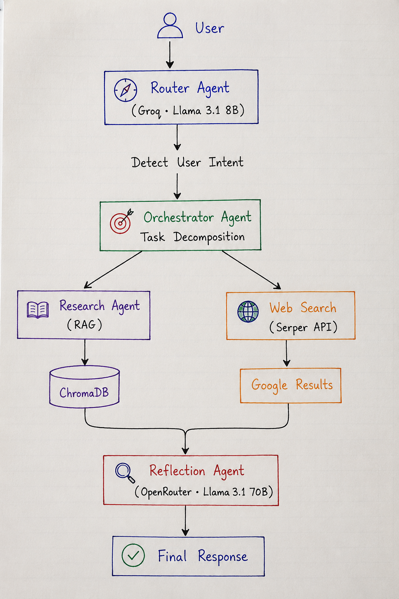
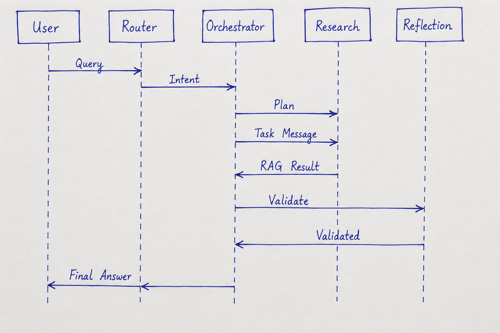
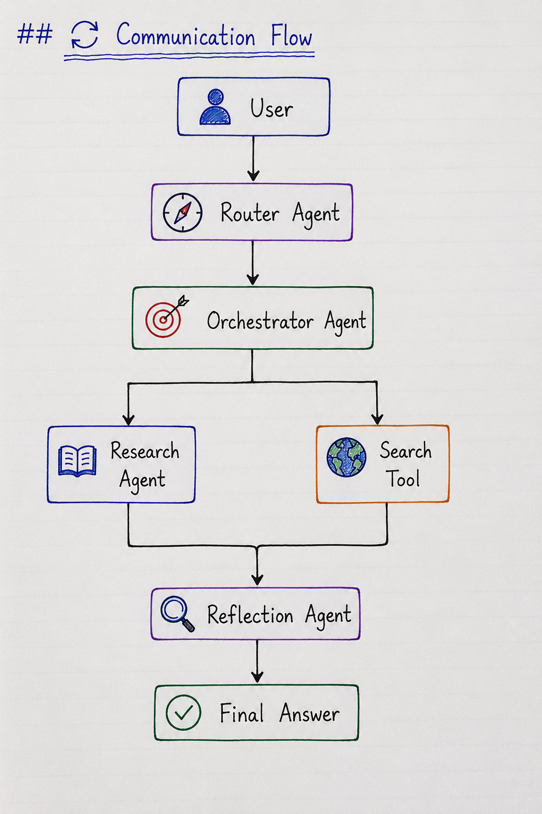
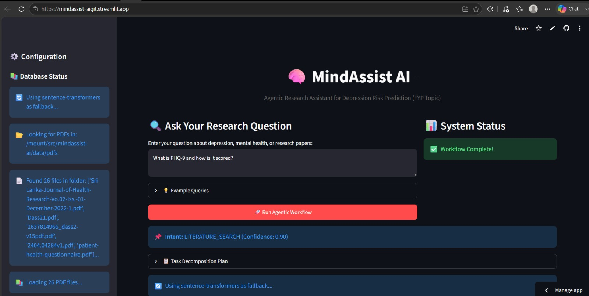
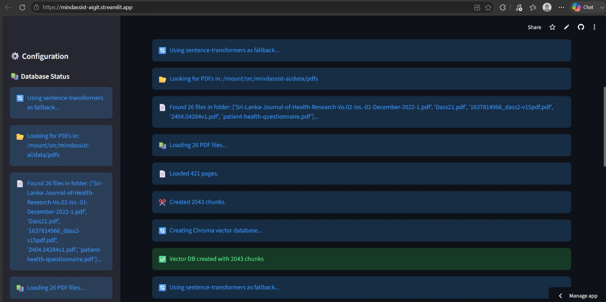
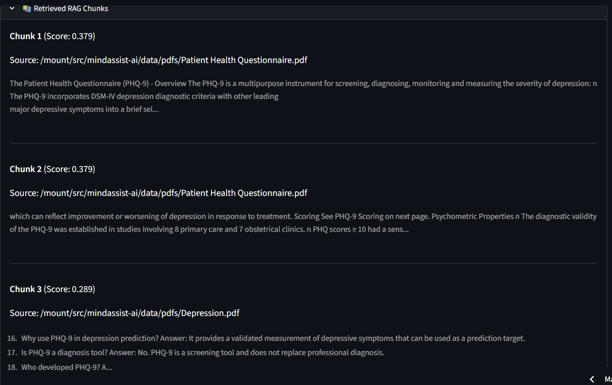
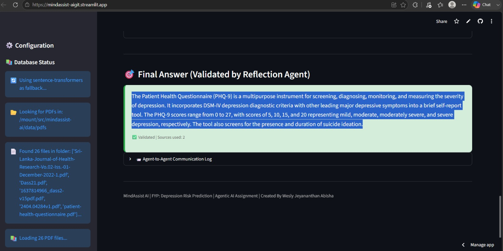

# 🧠 MindAssist AI

> **🤖 Agentic Research Assistant for Depression Risk Prediction**

[](https://mindassist-aigit.streamlit.app)
[](https://github.com/Abisha-2002/MindAssist-AI)


# 📖 Project Description

MindAssist AI is an **Agentic AI-powered research assistant** developed for **Depression Risk Prediction**. It combines **multi-agent orchestration**, **Retrieval-Augmented Generation (RAG)**, **web search**, and **reflection-based validation** to provide reliable, evidence-based answers from trusted mental health resources.

The system indexes **26+ mental health PDFs** (PHQ-9, DASS-21, GAD-7, Sri Lankan Mental Health Reports, WHO Guidelines, IEEE papers, etc.) and retrieves the most relevant information before generating responses.

## 🎯 Problem Statement

Researchers and university students often struggle to find accurate mental health information because resources are scattered across numerous research papers, reports, and screening guidelines.

## 💡 Solution

MindAssist AI solves this by using an **Agentic AI workflow** that can:

- 🧠 Understand user intent
- 📚 Search local research documents using RAG
- 🌐 Search the web when required
- ✅ Validate and improve responses before presenting the final answer

# 🏗️ System Architecture


---

# 🧩 Agentic Design Patterns

MindAssist AI follows multiple Agentic AI design patterns to coordinate task execution, retrieval, validation, and response generation.

| Design Pattern | Purpose | Implementation | Source File |
|----------------|---------|----------------|-------------|
| 🧭 Router Pattern | Classifies the user's intent and selects the appropriate workflow. | Routes user queries to the correct processing pipeline. | `agents/router_agent.py` |
| 🎯 Orchestrator–Worker Pattern | Coordinates the overall workflow and delegates tasks to specialized agents. | Manages communication between Research Agent, Web Search, and Reflection Agent. | `agents/orchestrator.py` |
| 📚 Tool-Use Pattern | Uses external tools to retrieve information from local documents and the web. | Performs RAG retrieval using ChromaDB and web search using the Serper API. | `agents/research_agent.py`<br>`tools/web_search.py` |
| 🔍 Reflection Pattern | Reviews, validates, and improves the generated response before presenting it to the user. | Ensures the final response is accurate, relevant, and evidence-based. | `agents/reflection_agent.py` |

  # 📸 Workflow Summary

1. **Router Agent** identifies the user's intent.
2. **Orchestrator Agent** plans and coordinates the workflow.
3. **Research Agent** retrieves relevant information using RAG (ChromaDB).
4. **Web Search Tool** gathers additional real-time information when required.
5. **Reflection Agent** validates and refines the response.
6. The validated answer is returned to the user.
 



# 🤖 Model Selection Strategy

| 🛠️ Sub-task | 🤖 Model / Provider | 💡 Reason for Selection |
|-------------|--------------------|--------------------------|
| 🎯 Intent Routing | Llama 3.1 8B (Groq) | Very low latency (~300ms), near-zero cost, ideal for classification |
| 🧠 Deep Reasoning | Llama 3.1 70B (OpenRouter) | Higher reasoning quality for medical responses |
| 🌍 Web Search | Serper API | Google-powered search with generous free tier |


# 🔄 Agent-to-Agent Communication

The agents communicate using structured **JSON messages**.

## 📦 Example JSON Message

```json
{
  "from": "Orchestrator",
  "to": "ResearchAgent",
  "payload": {
    "task": "rag_search",
    "query": "What is PHQ-9?",
    "k": 5
  },
  "metadata": {
    "intent": "literature_search",
    "message_id": 1
  }
}
```

## 🔁 Communication Flow



# 📚 Retrieval-Augmented Generation (RAG)

## 📖 Overview

MindAssist AI ingests **26+ mental health PDFs** and transforms them into searchable vector embeddings.


## ✂️ Chunking Strategy

| Parameter | Value |
|------------|--------|
| 📄 Chunk Size | 1000 Characters |
| 🔁 Chunk Overlap | 200 Characters |
| ✨ Separators | `\n\n`, `\n`, `.`, ` ` |


## 🧠 Embedding Model

| Item | Value |
|------|-------|
| Model | all-MiniLM-L6-v2 |
| Provider | Sentence Transformers |
| Embedding Size | 384 Dimensions |


## 🗂️ Vector Database

| Feature | Value |
|----------|--------|
| Database | ChromaDB |
| Search Method | Cosine Similarity |


## 📊 Retrieval Evaluation

| 🔍 Query | 📄 Retrieved Context | ✅ Relevance |
|-----------|---------------------|--------------|
| What is PHQ-9 and how is it scored? | PHQ-9 Scoring Guide | ⭐ 0.89 |
| Depression prevalence in Sri Lanka | Mental Health Report | ⭐ 0.85 |
| Latest ML techniques | IEEE Research Papers | ⭐ 0.82 |
| Depression Risk Factors | Student Mental Health Study | ⭐ 0.78 |
| Difference between DASS-21 and PHQ-9 | Screening Questionnaires | ⭐ 0.87 |

---

# ⚙️ Installation Guide

## 📥 Clone Repository

```bash
git clone https://github.com/Abisha-2002/MindAssist-AI.git
cd MindAssist-AI
```


## 🐍 Create Virtual Environment

### Windows

```bash
python -m venv venv
venv\Scripts\activate
```

### Linux / macOS

```bash
python3 -m venv venv
source venv/bin/activate
```

---

## 📦 Install Dependencies

```bash
pip install -r requirements.txt
```

---

## 🔑 Configure API Keys

Create:

```
.streamlit/secrets.toml
```

Add:

```toml
GROQ_API_KEY="gsk_your_key"

OPENROUTER_API_KEY="sk-or-v1_your_key"

SERPER_API_KEY="your_key"
```

---

## 📂 Add Research PDFs

Place all PDFs inside

```
data/pdfs/
```


## ▶️ Run Streamlit

```bash
streamlit run app.py
```


# 🚀 Live Demo

🌐 **Streamlit Application**

https://mindassist-aigit.streamlit.app


## 🎥 App Demo video

[](https://youtu.be/VEJFvglpH5c)

> **Demo Video:** A quick walkthrough of **MindAssist AI**, demonstrating depression risk prediction, PHQ-9 assessment, Retrieval-Augmented Generation (RAG), multi-agent workflow, and AI-powered responses using Groq/OpenRouter models.

**🔗 YouTube Demo:** https://youtu.be/VEJFvglpH5c

---






# 📂 Project Structure

```text
MindAssist-AI
│
├── agents/
│   ├── router_agent.py
│   ├── orchestrator.py
│   ├── research_agent.py
│   └── reflection_agent.py
│
├── rag/
│   ├── loader.py
│   └── embeddings.py
│
├── tools/
│   └── web_search.py
│
├── data/
│   └── pdfs/
│
├── utils/
│
├── app.py
├── requirements.txt
└── README.md
```

---

# 🌐 Deployment

### 🚀 Streamlit Community Cloud

✅ GitHub Repository Connected

✅ Secrets Configured

✅ Automatic Deployment Enabled

---

# ⚠️ Known Limitations

| ⚠️ Limitation | 📌 Description |
|---------------|----------------|
| 📄 Large PDFs | Loading large documents takes longer |
| 🌍 Search Limits | Serper API allows ~2,500 free searches/month |
| ⏱️ Rate Limits | Groq & OpenRouter free tiers have usage limits |
| 🗂️ Vector Database | ChromaDB rebuilds on deployment |
| 🌐 Language Support | Currently optimized for English |

---

# 🔀 GitHub Workflow

## 🌿 Branch Strategy

- ✅ main
- ✅ feature/rag-pipeline
- ✅ feature/agent-orchestration
- ✅ feature/model-router
- ✅ feature/streamlit-ui
- ✅ feature/web-search

---

## 💬 Commit Convention

```text
feat:
fix:
docs:
style:
refactor:
test:
chore:
```


# ✅ Assignment Requirements Checklist

| Requirement | Status |
|-------------|--------|
| 🤖 Agentic Design Patterns (≥3) | ✅ Completed |
| 🔄 Agent Communication | ✅ JSON Messaging |
| 🧠 Multi-Model Strategy | ✅ Groq + OpenRouter |
| 📚 RAG Pipeline (20+ PDFs) | ✅ 26 Documents |
| 🌐 Streamlit Deployment | ✅ Live |
| 🔀 GitHub Workflow | ✅ Branches + PRs + Commits |


# 🛠️ Technologies Used

- 🐍 Python
- 🎈 Streamlit
- 🧠 LangChain
- 🤖 Groq API
- 🌐 OpenRouter API
- 🔍 Serper API
- 📚 ChromaDB
- 🔡 Sentence Transformers
- 📝 HuggingFace Embeddings


# 👨‍💻 Author

## 👤 Abisha Wesly Jeyananthan

🎓  undergraduate at Horizon Campus

💻 BSc (Hons) Information Technology

📚 IT41043 – Intelligent Systems

🤖 Agentic AI Assignment


# ⭐ If you found this project useful

Please consider giving it a ⭐ on GitHub!

> **🧠 MindAssist AI — Empowering Depression Risk Research with Agentic AI, RAG, and Multi-Agent Intelligence.**

